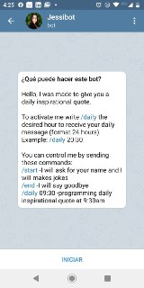
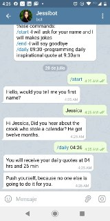
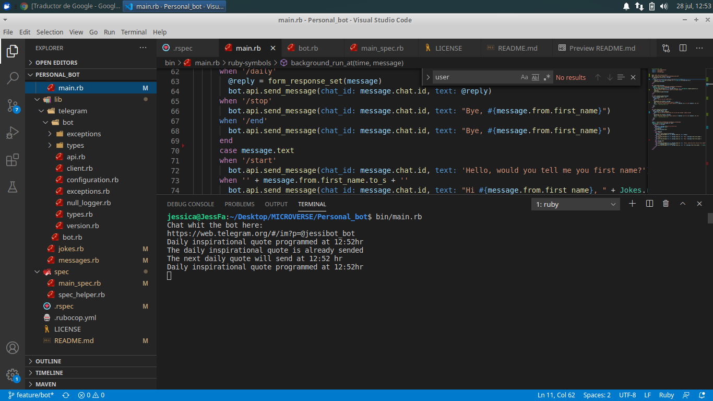

# Telegram bot
This bot is designed to send daily motivational messages and tell jokes every time the user types their name

## Built With

- Ruby 2.7.0
- Rubocop
- Rspec
- telegram-bot-ruby library

## Getting Started

To get a local copy up and running follow these simple example steps.

1. Open the terminal comand line window
2. `git clone https://github.com/jessicafarias/Personal_bot.git`
3. Open the spec folder and run the personal bot
4. Enjoy!

## Installation

Add following line to your Gemfile:

```ruby
gem 'telegram-bot-ruby'
```

And then execute:

```shell
$ bundle
```

Or install it system-wide:

```shell
$ gem install telegram-bot-ruby
```

## RUN PERSONAL BOT

To inicialize the telegram bot just write the following command on the root folder.

```ruby 
bin/main.rb 
``` 

## Instructions
1. Open Telegram the program provides you the link of the bot
2. In the telegram chat clic on "start" and automaticly you will write "/start" and the bot will ask you for your name
3. Write your name to display a joke
4. Write "/daily 20:30" to programm a daily inspirational quote 8:30pm every day
5. Verify the terminal displaying messages of the modification made by the user.

## Screenshots





## RUN TEST

To run the Rspec and check for testing cases write the following command on the root folder.

```ruby 
rspec 
``` 

## Demo Link of Enumerables Project

[Bot Link](https://web.telegram.org/#/im?p=@jessibot_bot).


## Authors

👤 **Jessica Farias**

- Github: [jessicafarias](https://github.com/jessicafarias)
- Twitter: [@FariasRosado](https://twitter.com/FariasRosado)
- Linkedin: [jessica-michelle-farias-rosado](https://www.linkedin.com/in/jessica-michelle-farias-rosado/)


## 🤝 Contributing

Contributions, issues and feature requests are welcome!

Feel free to check the [issues page](issues/).

## Show your support

Give a ⭐️ if you like this project!

## 📝 License

This project is [MIT](LICENSE) licensed.